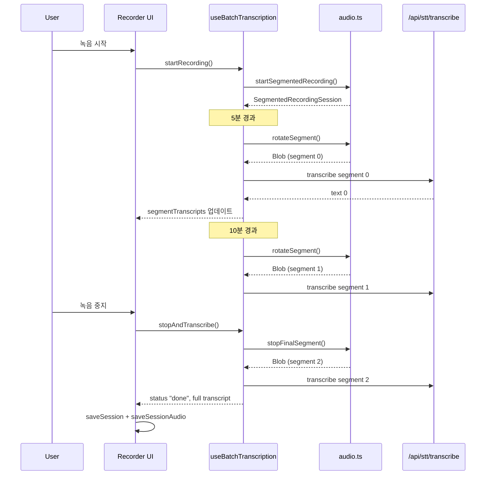

# 5분 세그먼트 녹음 + 디버그 오디오 저장

## 현재 문제

`gpt-4o-transcribe`는 출력 토큰 상한(16K)이 있어 긴 녹음 시 전사가 잘린다. 현재 코드는 전체 녹음을 단일 Blob으로 만들어 한 번에 전사하므로, 10분 이상 녹음에서 내용 유실이 발생한다.

## 핵심 전략

같은 `MediaStream`을 유지하면서 5분마다 `MediaRecorder`만 교체(rotate)하여 독립된 WebM 세그먼트를 생성한다. 각 세그먼트를 녹음 중에 백그라운드로 전사하여, 사용자가 중지 버튼을 누르면 마지막 세그먼트만 전사하면 된다.

## 데이터 흐름



## Step 1: `src/lib/audio.ts` -- SegmentedRecordingSession 추가

기존 `startBlobRecording`은 유지(하위 호환)하고, 새로운 `startSegmentedRecording` 함수를 추가한다.

**새 인터페이스:**

```typescript
export interface SegmentedRecordingSession {
  rotateSegment: () => Promise<Blob>;
  stopFinalSegment: () => Promise<Blob>;
  close: () => Promise<void>;
  analyser: AnalyserNode;
}
```

**핵심 설계:**

- `getUserMedia` + `AudioContext` + `AnalyserNode`는 전체 세션 수명 동안 유지
- `MediaRecorder`만 세그먼트 단위로 생성/정지
- `rotateSegment()`: 현재 recorder stop → Blob 반환 → 새 recorder start (~10-30ms 공백)
- `stopFinalSegment()`: 현재 recorder stop → Blob 반환 (새 recorder 시작 안 함)
- `close()`: stream track 정지, AudioContext close, 모든 리소스 해제

**테스트 파일:** `src/lib/__tests__/audio-segmented-recording.test.ts`

- 기존 [audio-blob-recording.test.ts](src/lib/__tests__/audio-blob-recording.test.ts)의 `MockMediaRecorder` 패턴 재사용
- rotateSegment가 유효한 Blob을 반환하는지
- rotate 후 analyser가 여전히 동작하는지
- stopFinalSegment 후 close가 stream을 정리하는지
- recorder 생성 실패 시 에러 전파

## Step 2: `src/lib/download-recording.ts` -- 다운로드 유틸리티 (새 파일)

```typescript
export function triggerBlobDownload(blob: Blob, filename: string): void;
export function downloadRecordingSegments(blobs: Blob[], prefix?: string): void;
```

- `URL.createObjectURL` + `<a download>` 패턴
- 세그먼트별 파일명: `{prefix}-segment-001.webm`, `002.webm`, ...
- revokeObjectURL 정리 포함

**테스트 파일:** `src/lib/__tests__/download-recording.test.ts`

## Step 3: `src/lib/db.ts` -- IndexedDB 스키마 확장

오디오 Blob을 세션과 별도 store에 저장한다. `sessions` store와 분리하여 `getAllSessions` 성능에 영향을 주지 않는다.

**변경 사항:**

- `DB_VERSION`: 1 → 2
- 새 object store `session-audio` 추가:

```typescript
'session-audio': {
  key: string; // sessionId
  value: {
    sessionId: string;
    blobs: Blob[];
    mimeType: string;
    segmentCount: number;
    createdAt: number;
  };
}
```

- `upgrade` 함수에 `if (oldVersion < 2)` 분기 추가
- 새 함수: `saveSessionAudio(sessionId, blobs, mimeType)`, `getSessionAudio(sessionId)`, `deleteSessionAudio(sessionId)`
- 기존 `saveSession`, `getSessionById`, `getAllSessions`는 **변경 없음**

**테스트:** `src/lib/__tests__/db.test.ts`에 케이스 추가

## Step 4: `src/hooks/use-batch-transcription.ts` -- 세그먼트 녹음으로 전환

가장 큰 변경. 핵심 로직을 단일 Blob 전사에서 세그먼트 기반으로 재작성한다.

**새 상수:**

```typescript
const SEGMENT_DURATION_MS = 5 * 60 * 1000; // 5분
```

**새 내부 상태:**

- `segmentBlobsRef: Ref<Blob[]>` -- 디버그 저장용 수집
- `segmentTextsRef: Ref<(string | null)[]>` -- 세그먼트별 전사 결과
- `segmentTranscripts: string[]` (useState) -- 완료된 세그먼트 텍스트 배열 (UI 노출)
- `segmentRotationTimerRef` -- 5분 간격 세그먼트 교체 타이머
- `inFlightCountRef` -- 현재 진행 중인 전사 수

**Return 타입 확장:**

```typescript
export type UseBatchTranscriptionReturn = {
  // 기존 필드 유지
  status: BatchTranscriptionStatus;
  transcript: string | null;
  errorMessage: string | null;
  elapsedMs: number;
  level: number;
  softLimitMessage: string | null;
  startRecording: () => Promise<void>;
  stopAndTranscribe: () => Promise<string | null>;
  retryTranscription: () => Promise<string | null>;
  // 새 필드
  segmentTranscripts: string[];
  segmentProgress: { completed: number; total: number } | null;
  recordingBlobs: Blob[] | null;
};
```

**startRecording 변경:**

- `startBlobRecording()` → `startSegmentedRecording()` 호출
- 세그먼트 교체 타이머 시작 (`setInterval(SEGMENT_DURATION_MS)`)
- 교체 시: `session.rotateSegment()` → Blob 수집 → 백그라운드 전사 시작
- 백그라운드 전사 완료 시 `segmentTranscripts` 상태 업데이트 (점진적 UI 반영)

**stopAndTranscribe 변경:**

- 세그먼트 교체 타이머 정리
- `session.stopFinalSegment()` → 마지막 세그먼트 Blob 수집
- `session.close()` → 리소스 해제
- 마지막 세그먼트 전사
- 진행 중인 백그라운드 전사 완료 대기
- 실패한 세그먼트 재시도
- 모든 세그먼트 텍스트 순서대로 합침 → `transcript` 설정
- `recordingBlobs`에 모든 세그먼트 Blob 저장

**retryTranscription 변경:**

- 실패한 세그먼트만 재시도
- 성공 시 해당 세그먼트 텍스트 갱신, 전체 합침

**기존 55분/60분 리밋은 유지** -- 세그먼트 교체와 독립적으로 동작

**테스트 파일:** `src/hooks/__tests__/use-batch-transcription.test.tsx` 대폭 확장

- 기존 테스트를 새 mock (`startSegmentedRecording`)에 맞게 갱신
- 5분 후 세그먼트 교체 + 백그라운드 전사 검증
- 점진적 `segmentTranscripts` 업데이트 검증
- stop 후 모든 세그먼트 합침 검증
- 세그먼트 전사 실패 시 에러 상태 + 재시도
- 1개 세그먼트(5분 미만 녹음) 케이스
- 60분 하드 리밋 + 세그먼트 교체 상호작용

## Step 5: `src/components/recorder.tsx` -- UI 업데이트

**변경 사항:**

- `batch.segmentTranscripts`를 `transcriptFinals`로 사용 (기존 `batch.transcript` 대신):

```typescript
const transcriptFinals =
  isBatchMode && batch.segmentTranscripts.length > 0
    ? batch.segmentTranscripts
    : isBatchMode
      ? []
      : finals;
```

- 전사 진행률 표시 (`segmentProgress` 활용):

```typescript
const batchLoadingMessage =
  batchTranscribing && batch.segmentProgress
    ? `전사 중... (${batch.segmentProgress.completed}/${batch.segmentProgress.total})`
    : batchTranscribing
      ? "전사 중..."
      : null;
```

- 녹음 완료 후 다운로드 버튼 추가:

```typescript
{
  isBatchMode && batch.status === "done" && batch.recordingBlobs ? (
    <button onClick={handleDownloadRecording}>녹음 파일 저장</button>
  ) : null;
}
```

- `persistAfterTranscript` 수정: `saveSession` 후 `saveSessionAudio(id, blobs)` 호출

**테스트:** `src/components/__tests__/recorder-batch.test.tsx` 갱신

- 진행률 메시지 렌더링
- 다운로드 버튼 노출 조건

## Step 6: `src/components/session-detail.tsx` -- 세션 오디오 다운로드

**변경 사항:**

- `getSessionAudio(id)` 호출하여 오디오 존재 여부 확인
- 오디오가 있으면 "녹음 파일 다운로드" 버튼 표시
- 클릭 시 `downloadRecordingSegments(blobs)` 호출

**테스트:** `src/components/__tests__/session-detail-audio.test.tsx` (새 파일)

## 파일 변경 요약

| 파일                                                                                                         | 변경 종류                                                            |
| ------------------------------------------------------------------------------------------------------------ | -------------------------------------------------------------------- |
| [src/lib/audio.ts](src/lib/audio.ts)                                                                         | 수정 -- `SegmentedRecordingSession` + `startSegmentedRecording` 추가 |
| `src/lib/download-recording.ts`                                                                              | **신규**                                                             |
| [src/lib/db.ts](src/lib/db.ts)                                                                               | 수정 -- v2 스키마, `session-audio` store, 새 함수 3개                |
| [src/hooks/use-batch-transcription.ts](src/hooks/use-batch-transcription.ts)                                 | **대폭 수정**                                                        |
| [src/components/recorder.tsx](src/components/recorder.tsx)                                                   | 수정 -- 점진적 전사 표시 + 다운로드 + 오디오 저장                    |
| [src/components/session-detail.tsx](src/components/session-detail.tsx)                                       | 수정 -- 오디오 다운로드 버튼                                         |
| `src/lib/__tests__/audio-segmented-recording.test.ts`                                                        | **신규**                                                             |
| `src/lib/__tests__/download-recording.test.ts`                                                               | **신규**                                                             |
| [src/lib/**tests**/db.test.ts](src/lib/__tests__/db.test.ts)                                                 | 수정                                                                 |
| [src/hooks/**tests**/use-batch-transcription.test.tsx](src/hooks/__tests__/use-batch-transcription.test.tsx) | **대폭 수정**                                                        |
| [src/components/**tests**/recorder-batch.test.tsx](src/components/__tests__/recorder-batch.test.tsx)         | 수정                                                                 |
| `src/components/__tests__/session-detail-audio.test.tsx`                                                     | **신규**                                                             |

## 엣지 케이스 처리

- **5분 미만 녹음**: 세그먼트 1개, 교체 없음 -- 기존 동작과 동일
- **정확히 5분에 중지**: 교체 타이머와 stop의 경합 방지 -- stop 시 타이머를 먼저 해제
- **세그먼트 전사 부분 실패**: 성공한 세그먼트 텍스트는 유지, 실패 세그먼트만 retry 대상
- **녹음 중 컴포넌트 언마운트**: `close()` 호출로 stream/context 정리, 진행 중 전사는 결과 무시
- **60분 하드 리밋**: 기존과 동일하게 `stopAndTranscribe` 자동 호출
- **IndexedDB 쿼터 초과**: `saveSessionAudio` 실패 시 경고만 표시, 세션 텍스트 저장에는 영향 없음
