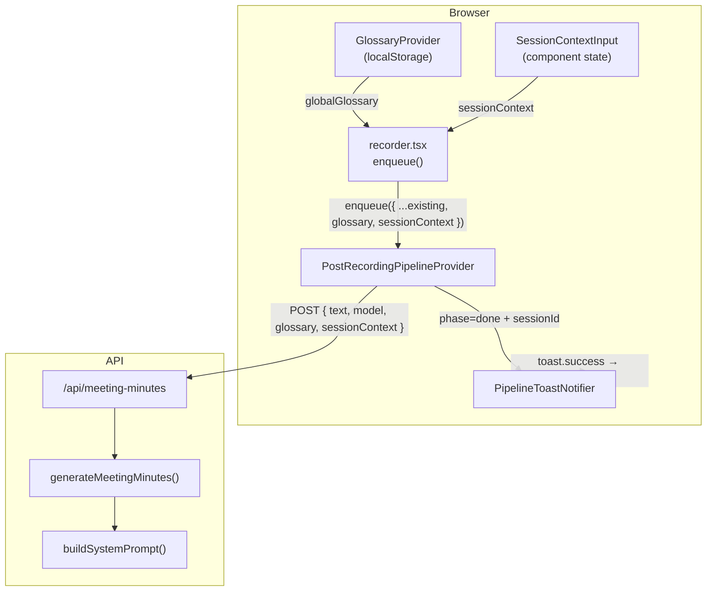

# 용어 사전 / 세션 컨텍스트 + 완료 토스트

## 전체 데이터 흐름



---

## 1. 타입 정의

새 파일 [`src/lib/glossary/types.ts`](src/lib/glossary/types.ts) 생성.

```typescript
export type GlossaryEntry = string;

export type GlobalGlossary = {
  terms: GlossaryEntry[];
};

export type SessionContext = {
  participants: string;
  topic: string;
  keywords: string;
};

export type MeetingContext = {
  glossary: GlossaryEntry[];
  sessionContext: SessionContext | null;
};
```

- `GlossaryEntry`는 MVP 단계에서 단순 문자열 (`"Kubernetes"`, `"김지호"`)로 시작한다. alias 매핑은 후속 확장 가능.
- `SessionContext`의 각 필드는 자유 텍스트(줄바꿈/쉼표 구분)로 입력받는다.
- `MeetingContext`는 API 전송 및 프롬프트 빌딩에 사용하는 통합 타입이다.

---

## 2. 전역 용어 사전 Context

새 파일 [`src/lib/glossary/context.tsx`](src/lib/glossary/context.tsx) 생성. 기존 [`src/lib/settings/context.tsx`](src/lib/settings/context.tsx)와 동일한 패턴(localStorage + Context).

- 스토리지 키: `whirr:global-glossary`
- Provider: `GlossaryProvider`
- Hook: `useGlossary()` → `{ glossary: GlobalGlossary, updateGlossary: (terms: string[]) => void }`
- [`src/components/providers/main-app-providers.tsx`](src/components/providers/main-app-providers.tsx)에 `GlossaryProvider` 추가

---

## 3. 회의록 프롬프트에 컨텍스트 주입

### 3-1. 프롬프트 빌더

[`src/lib/meeting-minutes/prompts.ts`](src/lib/meeting-minutes/prompts.ts)에 빌더 함수 추가.

기존 상수 3개는 그대로 두고, 새 함수를 추가한다:

```typescript
export function buildSystemPromptWithContext(
  basePrompt: string,
  context: MeetingContext | null,
): string {
  if (!context) return basePrompt;

  const sections: string[] = [basePrompt];

  if (context.glossary.length > 0) {
    sections.push(
      `\n\n## 용어 교정 가이드\n` +
        `아래는 회의에서 사용된 전문 용어·고유명사입니다. ` +
        `STT가 이 용어를 잘못 전사했을 수 있으니 ` +
        `문맥에 맞게 올바른 표기로 교정하세요.\n` +
        context.glossary.map((t) => `- ${t}`).join("\n"),
    );
  }

  const sc = context.sessionContext;
  if (sc) {
    if (sc.participants.trim()) {
      sections.push(`\n\n## 회의 참석자\n${sc.participants.trim()}`);
    }
    if (sc.topic.trim()) {
      sections.push(`\n\n## 회의 주제\n${sc.topic.trim()}`);
    }
    if (sc.keywords.trim()) {
      sections.push(`\n\n## 이번 회의 키워드\n${sc.keywords.trim()}`);
    }
  }

  return sections.join("");
}
```

- `MEETING_MINUTES_SINGLE_SYSTEM`, `MEETING_MINUTES_MAP_SYSTEM` 두 프롬프트 모두에 적용한다.
- `MEETING_MINUTES_REDUCE_SYSTEM` (reduce 단계)에는 적용하지 않는다 — map 단계에서 이미 교정이 반영되기 때문.

### 3-2. map-reduce 수정

[`src/lib/meeting-minutes/map-reduce.ts`](src/lib/meeting-minutes/map-reduce.ts)의 `generateMeetingMinutes` 시그니처 확장:

```typescript
export async function generateMeetingMinutes(
  text: string,
  options: {
    model: string;
    completeChat: CompleteChatFn;
    context?: MeetingContext | null;  // 추가
  },
): Promise<string> {
```

내부에서 `buildSystemPromptWithContext(MEETING_MINUTES_SINGLE_SYSTEM, context)` 및 `buildSystemPromptWithContext(MEETING_MINUTES_MAP_SYSTEM, context)`를 사용한다.

### 3-3. API Route 수정

[`src/app/api/meeting-minutes/route.ts`](src/app/api/meeting-minutes/route.ts)에서 요청 body에 `glossary?`, `sessionContext?` 필드를 파싱하고, `generateMeetingMinutes`에 `context`로 전달한다.

- `glossary`는 `string[]` 타입, 최대 항목 수 제한 (예: 200개)
- `sessionContext`는 `{ participants?: string, topic?: string, keywords?: string }`, 각 필드 최대 길이 제한 (예: 2000자)
- 유효성 검증 실패 시 `400` 응답

---

## 4. 파이프라인 입력 확장

### 4-1. enqueue 입력 타입

[`src/lib/post-recording-pipeline/context.tsx`](src/lib/post-recording-pipeline/context.tsx)의 `PostRecordingPipelineEnqueueInput`에 필드 추가:

```typescript
export type PostRecordingPipelineEnqueueInput = {
  // ...기존 필드
  glossary?: string[];
  sessionContext?: SessionContext | null;
};
```

### 4-2. 파이프라인 내부 fetch 수정

`/api/meeting-minutes`로 보내는 `body`에 `glossary`, `sessionContext` 포함:

```typescript
body: JSON.stringify({
  text: fullText,
  model: input.meetingMinutesModel,
  glossary: input.glossary,
  sessionContext: input.sessionContext,
}),
```

### 4-3. 완료된 세션 ID 노출

현재 파이프라인 context value에 `completedSessionId: string | null` 필드를 추가한다. `setPhase("done")` 시점에 함께 설정하고, `idle`로 리셋될 때 `null`로 초기화한다. 이 값은 토스트 알림에서 네비게이션에 사용된다.

---

## 5. Recorder에서 컨텍스트 수집 및 전달

### 5-1. 세션 컨텍스트 입력 컴포넌트

새 파일 [`src/components/session-context-input.tsx`](src/components/session-context-input.tsx) 생성.

- 3개 필드: 참석자(`textarea`), 주제(`input`), 키워드(`input`)
- 접을 수 있는 섹션 (기본 펼침)
- `disabled` prop으로 잠금 상태 제어
- 잠금 시 "회의록 생성 중에는 수정할 수 없습니다." 안내 표시

### 5-2. recorder.tsx 수정

[`src/components/recorder.tsx`](src/components/recorder.tsx)에서:

- `useGlossary()`로 전역 용어 읽기
- `useState<SessionContext>`로 세션 컨텍스트 상태 관리
- `<SessionContextInput>` 렌더링 (녹음 영역 바로 아래, transcript 위)
- `stop()` → `enqueuePipeline()` 호출 시 `glossary`와 `sessionContext` 포함
- `pipeline.isBusy`일 때 `SessionContextInput`에 `disabled={true}` 전달

### 5-3. 배치 정리

`recorder.tsx`의 `stop` 함수에서 두 경로(batch / streaming) 모두에 `glossary`, `sessionContext`를 enqueue input에 추가.

---

## 6. 전역 용어 사전 편집 UI

[`src/components/settings-panel.tsx`](src/components/settings-panel.tsx)에 "전역 용어 사전" 섹션 추가.

- 위치: 회의록 모델 선택 아래, 언어 설정 위
- UI: `<textarea>` (한 줄에 하나씩 입력 안내)
- 예시 placeholder: `"Kubernetes\n김지호\nOKR\nVercel"`
- `useGlossary()`의 `updateGlossary`로 저장
- 녹음 중에는 기존 설정처럼 disabled

---

## 7. Sonner 토스트 알림

### 7-1. 패키지 설치

```bash
npm install sonner
```

### 7-2. Toaster 마운트

[`src/app/layout.tsx`](src/app/layout.tsx)의 `<body>` 안에 `<Toaster />` 추가. 위치가 전역이어야 SPA 내비게이션 후에도 토스트가 유지된다.

### 7-3. 알림 컴포넌트

새 파일 [`src/components/pipeline-toast-notifier.tsx`](src/components/pipeline-toast-notifier.tsx) 생성.

```typescript
"use client";

export function PipelineToastNotifier() {
  const { phase, completedSessionId } = usePostRecordingPipeline();
  const router = useRouter();
  const prevPhaseRef = useRef(phase);

  useEffect(() => {
    if (
      prevPhaseRef.current !== "done" &&
      phase === "done" &&
      completedSessionId
    ) {
      toast.success("회의록이 완성되었습니다", {
        action: {
          label: "바로 보기",
          onClick: () => router.push(`/sessions/${completedSessionId}`),
        },
        duration: 8000,
      });
    }
    prevPhaseRef.current = phase;
  }, [phase, completedSessionId, router]);

  return null;
}
```

- [`src/components/providers/main-app-providers.tsx`](src/components/providers/main-app-providers.tsx)에서 `PostRecordingPipelineProvider` 안쪽에 `<PipelineToastNotifier />` 마운트
- `duration: 8000`으로 충분한 시간 동안 표시
- `useRouter`의 `push`로 세션 상세 페이지 이동 (프로젝트에서 첫 `useRouter` 사용이므로 Next.js 16 호환 확인 필요)

---

## 8. DB 세션에 컨텍스트 저장 (선택적)

[`src/lib/db.ts`](src/lib/db.ts)의 `Session` 타입에 `context?: MeetingContext` 필드 추가. DB 버전 업그레이드 없이 optional 필드로 저장 가능 (IndexedDB는 값 객체에 새 필드를 자유롭게 추가할 수 있음). 세션 상세 페이지에서 어떤 용어 사전/컨텍스트가 사용되었는지 확인할 수 있게 된다.

---

## 수정 대상 파일 요약

| 파일                                                      | 변경                                                |
| --------------------------------------------------------- | --------------------------------------------------- |
| **신규** `src/lib/glossary/types.ts`                      | 타입 정의                                           |
| **신규** `src/lib/glossary/context.tsx`                   | 전역 용어 사전 Context + localStorage               |
| `src/lib/meeting-minutes/prompts.ts`                      | `buildSystemPromptWithContext` 함수 추가            |
| `src/lib/meeting-minutes/map-reduce.ts`                   | `context` 파라미터 수신, 프롬프트 빌더 호출         |
| `src/app/api/meeting-minutes/route.ts`                    | `glossary`, `sessionContext` 파싱/검증/전달         |
| `src/lib/post-recording-pipeline/context.tsx`             | enqueue 입력 확장, `completedSessionId` 노출        |
| `src/lib/db.ts`                                           | `Session` 타입에 `context?` 추가                    |
| `src/components/providers/main-app-providers.tsx`         | `GlossaryProvider` + `PipelineToastNotifier` 추가   |
| `src/components/recorder.tsx`                             | glossary/sessionContext 읽기/전달 + UI 배치         |
| **신규** `src/components/session-context-input.tsx`       | 세션 컨텍스트 입력 UI                               |
| `src/components/settings-panel.tsx`                       | 전역 용어 사전 textarea 섹션 추가                   |
| `src/app/layout.tsx`                                      | `<Toaster />` 마운트                                |
| **신규** `src/components/pipeline-toast-notifier.tsx`     | 파이프라인 완료 토스트                              |
| `src/lib/meeting-minutes/fetch-meeting-minutes-client.ts` | 요청 body에 context 필드 추가 (파이프라인과 일관성) |
